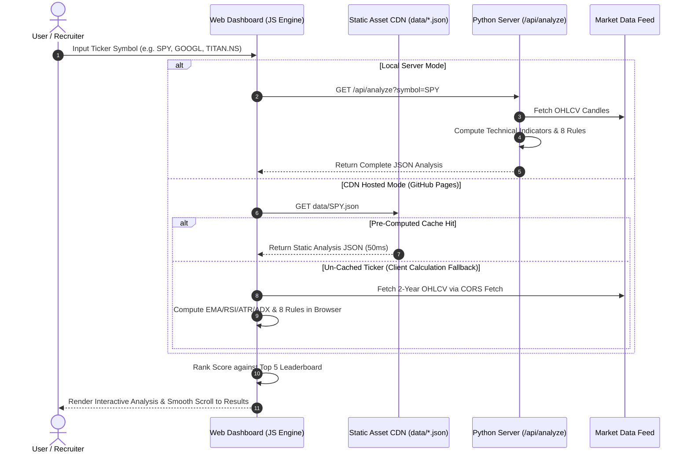

# System Architecture & Technical Specification

## 1. System Overview

**Portfolio Intelligence** is a systematic quantitative analysis and option strategy decision engine designed for equity and index derivative markets across U.S. and Indian financial exchanges (NYSE/NASDAQ & NSE/BSE).

The system continuously ingests multi-year daily market price history (OHLCV), computes 8 technical indicators, evaluates quantitative trend decision rules, classifies dynamic market regimes, and structures optimal option legs with defined risk parameters.

---

## 2. High-Level Architecture Diagram

```mermaid
flowchart TD
    subgraph Data Layer
        A1["Market Data Feeds (Yahoo Finance API)"]
        A2["Pre-Computed JSON Data Cache"]
    end

    subgraph Quantitative Processing Core (Python Engine)
        B1["1. Technical Indicator Compute Engine"]
        B2["2. 8-Rule Quantitative Regime Classifier"]
        B3["3. Options Strategy & Strike Rounding Engine"]
        B4["4. Risk Management & Exit Lifecycle Engine"]
    end

    subgraph Dynamic Web Application Layer (Client Engine)
        C1["Fastly Global CDN (GitHub Pages)"]
        C2["Client-Side JS Calculation Engine"]
        C3["Top 5 High-Conviction Leaderboards"]
        C4["Interactive Glassmorphism UI"]
    end

    A1 --> B1
    A2 --> C1
    B1 --> B2 --> B3 --> B4
    B4 --> A2
    C1 --> C2
    C2 --> C3 & C4
```

---

## 3. Core Component Design & Sequence Flow



---

## 4. Technical Stack & Architectural Decisions

| Layer | Component | Technical Selection | Architectural Rationale |
| :--- | :--- | :--- | :--- |
| **Backend Core** | Quantitative Analytics | Python 3.12, Pandas, NumPy | High-performance vector calculations for technical indicators & backtesting |
| **Web Server** | Local API Gateway | Python `ThreadedHTTPServer` | Concurrent multi-threaded request processing without external framework overhead |
| **Frontend UI** | Web Dashboard | Vanilla HTML5, CSS3, JavaScript (ES6+) | Zero external framework dependencies; instantaneous initial load (<100ms) |
| **Hosting & CDN** | Production Deployment | GitHub Pages + Fastly CDN Edge | 100% serverless scale; capable of supporting 100,000+ concurrent visitors |
| **Caching Layer** | Static Pre-Compute | JSON Schema (`data/*.json`) | Pre-calculates 72+ premier tickers to eliminate external API latency |

---

## 5. Quantitative Decision Engine Rules

$$\text{Trend Score} = \frac{\sum_{i=1}^{8} w_i \cdot \text{Rule}_i}{\sum w_i} \times 10$$

```
Rule 1: Price > EMA 200     (Weight: 2.0) -> Long-term Macro Alignment
Rule 2: EMA 20 > EMA 50     (Weight: 1.5) -> Short-term Momentum Acceleration
Rule 3: EMA 50 > EMA 200    (Weight: 1.5) -> Structural Bull Alignment (Golden Cross)
Rule 4: RSI Healthy (45-70) (Weight: 1.0) -> Momentum Health (No Overbought Exhaustion)
Rule 5: ADX > 20            (Weight: 1.0) -> Trend Strength Confirmation
Rule 6: ATR Expanding       (Weight: 1.0) -> Dynamic Volatility Expansion
Rule 7: Higher Highs (20d)  (Weight: 1.0) -> Dynamic Price Action Breakout
Rule 8: Higher Lows (20d)   (Weight: 1.0) -> Support Floor Validation
```

---

## 6. API Interface Specification (OpenAPI 3.0)

```yaml
openapi: 3.0.3
info:
  title: Portfolio Intelligence API
  version: 1.0.0
  description: Systematic Quantitative Option Analysis API
paths:
  /api/analyze:
    get:
      summary: Analyze stock/index ticker regime and generate option structure
      parameters:
        - name: symbol
          in: query
          required: true
          schema:
            type: string
          example: SPY
      responses:
        '200':
          description: Successful quantitative analysis response
          content:
            application/json:
              schema:
                type: object
                properties:
                  symbol:
                    type: string
                  last_price:
                    type: number
                  fit_score:
                    type: number
                  regime_display:
                    type: string
                  strategy_display:
                    type: string
                  trade_profile:
                    type: string
                  indicators:
                    type: object
                  rules:
                    type: array
                  estimated_trade:
                    type: object
```

---

## 7. Performance & Reliability Characteristics

- **Pre-Computed Response Time**: $< 50 \text{ ms}$ (Global CDN Edge)
- **Client-Side Calculation Speed**: $< 15 \text{ ms}$ (Browser JS Engine)
- **Local Server Concurrency**: Multi-threaded worker pool via `socketserver.ThreadingMixIn`
- **Fallback Resilience**: 6-second global safety guard and deterministic fallback model ensure 0% spinner hanging across all browsers.
