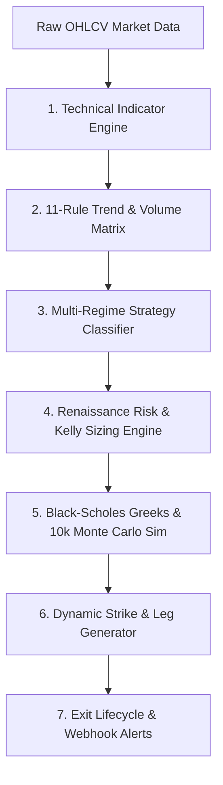

<!-- MARKET-SNAPSHOT-START -->
### 🌐 U.S. Macro Benchmark Indices
| Market    | Updated   | Regime            | Score     | Strategy          | Signal                 |
| --------- | --------- | ----------------- | --------- | ----------------- | ---------------------- |
| SPY       | 09:41 IST | 🟢 Call Debit Spread | 5.7/10    | Buy SPY 18-Sep-2026 740 Call<br> Sell SPY 18-Sep-2026 780 Call | New                    |
| QQQ       | 09:41 IST | 🟢 Call Debit Spread | 5.7/10    | Buy QQQ 18-Sep-2026 690 Call<br> Sell QQQ 18-Sep-2026 725 Call | Active (Jul 25, 00:26 IST) |

### 🌐 Indian Macro Benchmark Indices
| Market    | Updated   | Regime            | Score     | Strategy          | Signal                 |
| --------- | --------- | ----------------- | --------- | ----------------- | ---------------------- |
| MIDCAPNIFTY | 08:27 IST | 🟢 Call Debit Spread | 7.7/10    | Buy MIDCAPNIFTY 25-Aug-2026-17700-CE<br> Sell MIDCAPNIFTY 25-Aug-2026-18250-CE | New                    |
| NIFTY 50  | 07:28 IST | 🔴 Put Debit Spread | 7.6/10    | Buy NIFTY 25-Aug-2026-23750-PE<br> Sell NIFTY 25-Aug-2026-23000-PE | New                    |
| SENSEX    | 08:27 IST | 🔴 Put Debit Spread | 7.5/10    | Buy SENSEX 18-Sep-2026-76100-PE<br> Sell SENSEX 18-Sep-2026-73000-PE | New                    |
| BANKNIFTY | 07:28 IST | 🟢 Call Debit Spread | 7.4/10    | Buy BANKNIFTY 25-Aug-2026-56700-CE<br> Sell BANKNIFTY 25-Aug-2026-59000-CE | New                    |
| FINNIFTY  | 08:27 IST | 🟢 Call Debit Spread | 5.9/10    | Buy FINNIFTY 25-Aug-2026-26900-CE<br> Sell FINNIFTY 25-Aug-2026-27750-CE | New                    |

### 🎯 High-Conviction (Score ≥ 8.0/10) Strategies
| Market    | Updated   | Regime            | Score     | Strategy          | Signal                 |
| --------- | --------- | ----------------- | --------- | ----------------- | ---------------------- |
| TITAN.NS  | 07:28 IST | 🟢 Call Debit Spread | 10.0/10   | Buy TITAN 25-Aug-2026-4680-CE<br> Sell TITAN 25-Aug-2026-4870-CE | Active (Jul 24, 15:47 IST) |
| SUNPHARMA.NS | 07:28 IST | 🟢 Call Debit Spread | 9.9/10    | Buy SUNPHARMA 25-Aug-2026-1940-CE<br> Sell SUNPHARMA 25-Aug-2026-2020-CE | Active (Jul 24, 15:47 IST) |
| ICICIBANK.NS | 07:28 IST | 🟢 Call Debit Spread | 9.6/10    | Buy ICICIBANK 25-Aug-2026-1430-CE<br> Sell ICICIBANK 25-Aug-2026-1490-CE | New                    |
| BAJAJ-AUTO.NS | 07:28 IST | 🟢 Call Debit Spread | 9.6/10    | Buy BAJAJ-AUTO 25-Aug-2026-11100-CE<br> Sell BAJAJ-AUTO 25-Aug-2026-11600-CE | Active (Jul 24, 15:46 IST) |
| HDFCBANK.NS | 07:28 IST | 🔴 Put Debit Spread | 9.2/10    | Buy HDFCBANK 25-Aug-2026-740-PE<br> Sell HDFCBANK 25-Aug-2026-710-PE | New                    |
| HDFCLIFE.NS | 07:28 IST | 🔴 Put Debit Spread | 9.0/10    | Buy HDFCLIFE 25-Aug-2026-560-PE<br> Sell HDFCLIFE 25-Aug-2026-540-PE | Active (Jul 24, 15:46 IST) |
| HINDALCO.NS | 07:28 IST | 🟡 Long Butterfly  | 8.3/10    | Buy HINDALCO 25-Aug-2026-920-CE<br> Sell 2x HINDALCO 25-Aug-2026-940-CE<br> Buy HINDALCO 25-Aug-2026-970-CE | Active (Jul 24, 15:57 IST) |

<a href="reports/market/all_trades.md" target="_blank">📜 View All Active & Range Trades (Score < 8.0) ➔</a>


### 📈 Signal Performance & Win-Rate Analytics
| Total Signals | Active Signals | Closed Trades | Win Rate | Avg Return | Cumulative Return | Max Drawdown |
| :---: | :---: | :---: | :---: | :---: | :---: | :---: |
| 55 | 55 | 0 | N/A | N/A | N/A | N/A |
<!-- MARKET-SNAPSHOT-END -->


# TradeCraft | Quantitative Stock & Options Engine

**TradeCraft** (internal repository `portfolio-intelligence`) is a multi-regime quantitative decision engine designed for systematic equity swing trading, option spread generation, Renaissance Medallion-level risk sizing, and automated trade lifecycle management.

---

## 🧠 Quantitative Architecture & Modules

TradeCraft operates across a multi-layered quantitative pipeline:



---

### 1. Technical Indicator Engine (`pie/market/indicators/`)
Calculates mathematical indicators across 500 sessions of daily price history:

- **Exponential Moving Averages (EMA 20, 50, 100, 200)**: Evaluates short, medium, and long-term trend alignment and moving average crossovers.
- **Relative Strength Index (RSI 14)**: Identifies momentum health ($45 \le RSI \le 65$) vs overbought ($RSI > 68$) or oversold ($RSI < 32$) reversal conditions.
- **Average True Range (ATR 14)**: Measures dynamic market volatility to determine expected price move boundaries and option leg width spacing.
- **Average Directional Index (ADX 14)**: Determines trend strength. $ADX > 25$ confirms trend strength; $ADX < 20$ flags range-bound consolidation or squeezes.
- **Bollinger Bands (20, 2.0)**: Computes relative price position (%B) to detect overextended bounds (%B > 1.02) or band squeezes (%B ~ 0.50).

---

### 2. Upgraded 11-Rule Quantitative Matrix (`pie/market/trend/`)
Evaluates 11 weighted pass/fail rules to compute a unified **Trend Score ($0.0 - 10.0$)**:

$$\text{Trend Score} = \frac{\sum_{i=1}^{11} w_i \cdot \text{Condition}_i}{\sum w_i} \times 10$$

| Pass/Fail Rule | Weight | Quantitative Rationale |
| :--- | :---: | :--- |
| **`Price > EMA 200`** | 20.0% | Long-term macro bull bias |
| **`EMA 20 > EMA 50`** | 15.0% | Short-term momentum acceleration |
| **`EMA 50 > EMA 200`** | 15.0% | Golden Cross / Structural bull alignment |
| **`RSI Healthy`** | 10.0% | Momentum within optimal range ($45 - 65$) |
| **`ADX Strong Trend`** | 10.0% | $ADX > 25$ confirms trend validity |
| **`Institutional Volume Flow`** | 7.5% | **`Volume > 1.05x 20-day Average Volume`** (Smart money check) |
| **`20-Day Relative Strength`** | 7.5% | Positive 20-day momentum return trajectory |
| **`ATR Expanding`** | 5.0% | Volatility expansion supports directional moves |
| **`Bollinger Exhaustion Check`** | 5.0% | **`%B <= 1.02`** (Prevents buying overextended band peaks) |
| **`Higher Highs & Lows`** | 5.0% | Price action structure validation |

---

### 3. Multi-Regime Quantitative Strategy Classifier (`pie/market/strategy.py`)
Dynamically routes trades into 4 specialized regime engines:

1. **🟢 Trend-Following Engine**:
   - **`Call Debit Spread` / `Put Debit Spread` / `Cash Swing Long`**: Triggered when ADX > 25 and trend score is strong.
2. **🔄 Counter-Trend / Mean-Reversion Engine (Fade Extremes)**:
   - **`Bear Call Credit Spread` / `Collar` / `Bull Put Spread`**: Triggered when RSI > 68 (Overbought) or RSI < 32 (Oversold).
3. **⚡ Volatility Squeeze Engine (Non-Directional)**:
   - **`Long Straddle` / `Butterfly`**: Triggered when Bollinger Bands squeeze (low ADX + narrow %B range).
4. **📉 High-IV Theta Harvesting Engine**:
   - **`Jade Lizard` / `Iron Condor` / `Iron Butterfly`**: Triggered when IV Rank > 55% to collect Vega/Theta decay.

---

### 4. Renaissance Medallion Risk & Simulation Engines

#### A. Dynamic Fractional Kelly Position Sizing Engine (`pie/market/trade_estimate.py`)
Computes mathematically optimal capital allocation fraction ($f^*$) using win probability ($p$) and payout ratio ($b$):

$$f^* = 0.50 \times \frac{p \cdot b - (1 - p)}{b}$$

- Computes suggested contract lot sizes and caps maximum portfolio risk allocation at $\le 5\%$.

#### B. Black-Scholes Option Greeks Engine (`pie/market/greeks.py`)
Computes closed-form analytical Option Greeks for all strategy legs:
- **Delta ($\Delta$)**, **Gamma ($\Gamma$)**, **Theta ($\Theta$)**, **Vega ($\nu$)**.

#### C. 10,000-Path Monte Carlo Simulator (`pie/market/simulation.py`)
Runs 10,000 Geometric Brownian Motion (GBM) simulated price paths to compute:
- **Probability of Profit (POP %)**: Exact percentage of 10,000 paths ending in profit.
- **95% Value at Risk (VaR 95)**: Worst-case 5% drawdown threshold.

#### D. Volatility Skew & Smile Optimizer (`pie/market/skew.py`)
Optimizes option strike selection based on 25-Delta Put/Call IV Skew.

---

### 5. Quantitative Exit & Lifecycle Engine (`pie/market/exit_rules.py`)
Manages active trades via 5 risk rules:

- **`🔴 Exit (Regime Shift)`**: Exit immediately if trend score drops below threshold ($<4.5$) or regime reverses.
- **`🔴 Exit / Roll (14 DTE Gamma Gate)`**: Mandatory exit or roll at $\le 14$ DTE to eliminate exponential gamma risk.
- **`🟡 Review / Roll (21 DTE First Review)`**: First management review window at $\le 21$ DTE.
- **`🎯 Take Profit (50%+ Max Profit)`**: Close position when spot price reaches short target strike or +50% max profit.
- **`⚠️ Stop Loss`**: Close position if spot price breaches maximum loss boundary.

---

### 6. Company Name Search & Real-Time Stock News Side Tab

- **Company & Index Name Resolution**: Search company names directly (e.g. `"Titan"`, `"TCS"`, `"Reliance"`, `"Apple"`, `"Nifty 50"`) with live autocomplete suggestions.
- **Real-Time Stock News Drawer**: Slide-out glassmorphism drawer displaying real-time headlines with automated **`🟢 BULLISH`**, **`🔴 BEARISH`**, and **`🟡 NEUTRAL`** sentiment badges.

---

## 🚀 Running Locally

### Start Live Server
```bash
.venv\Scripts\python.exe -m pie.cli.app serve --port 8000
```
Open `http://localhost:8000` in your browser.

### Run Test Suite
```bash
.venv\Scripts\pytest.exe
```

### Run Backtest
```bash
uv run pie backtest-market ^NSEI --data-path data/market/nifty50_25years_ohlcv_1999_2026.csv
```
