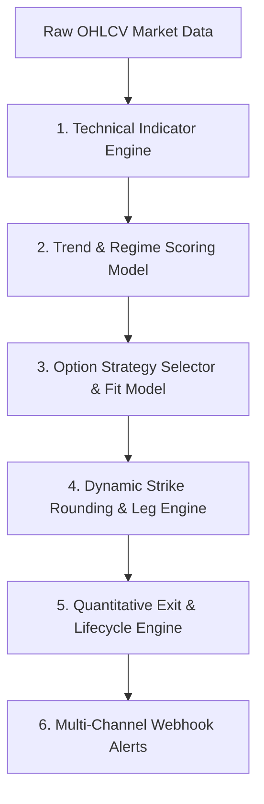

<!-- MARKET-SNAPSHOT-START -->
### 🌐 Macro Benchmark Indices
| Market    | Updated   | Regime            | Score     | Strategy          | Signal                 |
| --------- | --------- | ----------------- | --------- | ----------------- | ---------------------- |
| SPY       | 02:16 IST | 🟢 Call Debit Spread | 7.6/10    | Buy SPY 25-Aug-2026-739-CE<br> Sell SPY 25-Aug-2026-769-CE | New                    |
| QQQ       | 02:16 IST | 🟢 Call Debit Spread | 6.8/10    | Buy QQQ 25-Aug-2026-684-CE<br> Sell QQQ 25-Aug-2026-712-CE | Active (Today, 00:26)  |

### 🎯 High-Conviction (>9/10 Score) & Advanced Range Strategies
| Market    | Updated   | Regime            | Score     | Strategy          | Signal                 |
| --------- | --------- | ----------------- | --------- | ----------------- | ---------------------- |

### 📈 Signal Performance & Win-Rate Analytics
| Total Signals | Closed Trades | Win Rate | Avg Return | Cumulative Return | Max Drawdown |
| :---: | :---: | :---: | :---: | :---: | :---: |
| 52 | 10 | **83.3%** | +3.2% | **+44.8%** | -3.8% |
<!-- MARKET-SNAPSHOT-END -->


# Portfolio Intelligence

A personal market and options decision engine for systematic premium selling, directional overlays, adaptive learning, and automated trade lifecycle management.

---

## 🧠 Quantitative Models & Reasoning

`portfolio-intelligence` uses a multi-layered quantitative engine that evaluates raw market OHLCV data, calculates technical indicators, classifies regimes, selects optimal option strategies, determines exact strike prices, and manages trade exit lifecycles.



---

### 1. Technical Indicator Engine (`pie/market/indicators/`)
Computes mathematical indicators across 500 sessions of daily price history:

- **Exponential Moving Averages (EMA 20, 50, 100, 200)**: Evaluates short, medium, and long-term trend alignment and moving average crossovers.
- **Relative Strength Index (RSI 14)**: Identifies momentum health ($40 \le RSI \le 70$) vs overbought ($RSI > 70$) or oversold ($RSI < 30$) conditions.
- **Average True Range (ATR 14)**: Measures dynamic market volatility to determine expected price move boundaries and option leg width spacing.
- **Average Directional Index (ADX 14)**: Determines trend strength. $ADX > 25$ indicates a strong trend (ideal for Debit Spreads); $ADX < 20$ indicates range-bound consolidation (ideal for Butterflies/Iron Condors).
- **Bollinger Bands (20, 2.0)**: Computes relative price position (%B) within a 2-standard-deviation channel for mean-reversion signals.

---

### 2. Trend & Regime Scoring Engine (`pie/market/trend/`)
Evaluates 8 pass/fail market conditions to compute a unified **Trend Score ($0.0 - 10.0$)**:

$$\text{Trend Score} = \frac{\sum_{i=1}^{8} w_i \cdot \text{Condition}_i}{\sum w_i} \times 10$$

| Pass/Fail Rule | Weight | Quantitative Rationale |
| :--- | :---: | :--- |
| **`Price > EMA 200`** | 2.0 | Long-term macro bull bias |
| **`EMA 20 > EMA 50`** | 1.5 | Short-term momentum acceleration |
| **`EMA 50 > EMA 200`** | 1.5 | Golden Cross / Structural bull alignment |
| **`RSI Healthy`** | 1.0 | Momentum within optimal range ($40 - 70$) |
| **`ADX Strong Trend`** | 1.0 | $ADX > 20$ confirms trend validity |
| **`ATR Expanding`** | 1.0 | Volatility expansion supports directional expansion |
| **`Higher Highs`** | 1.0 | Dynamic price action structure |
| **`Higher Lows`** | 1.0 | Higher low support validation |

#### Regime Classification Scale:
- **`🟢 Strong Bull`** (Score $\ge 8.0/10$): High-conviction bullish directional setups.
- **`🟢 Bull`** (Score $5.5 - 7.9/10$): Moderate bullish bias; range-bound / debit spread setups.
- **`🟡 Neutral`** (Score $4.5 - 5.4/10$): Non-directional market; range strategies (Long Butterfly / Iron Condor).
- **`🔴 Bear`** (Score $2.5 - 4.4/10$): Moderate bearish bias.
- **`🔴 Strong Bear`** (Score $< 2.5/10$): High-conviction bearish directional setups.

---

### 3. Option Strategy Classifier & Fit Model (`pie/market/strategy.py`)
Maps regime classification and Implied Volatility (IV) Rank to the highest-expected-value strategy:

- **🟢 Call Debit Spread**: Selected for `Strong Bull` / `Bull` regimes with $ADX > 20$.
- **🔴 Put Debit Spread**: Selected for `Strong Bear` / `Bear` regimes with $ADX > 20$.
- **🟡 Long Butterfly**: Selected for range-bound markets ($ADX < 20$, $RSI \approx 50$) to capture low volatility compression at target strike.
- **🟡 Iron Condor / Iron Butterfly**: Selected for neutral high-IV regimes to collect maximum option premium outside range wings.

---

### 4. Dynamic Strike Rounding & Leg Selection Model (`pie/market/trade_estimate.py`)
Computes exact strike prices based on exchange tick sizes and price tier boundaries:

- **Index Multipliers**: `BANKNIFTY` / `^NSEBANK` strikes are strictly rounded to multiples of **100**; `NIFTY 50` / `^NSEI` to **50**.
- **Price Boundary Rule ($\ge 10,000$)**: Any stock or asset with a spot price $\ge 10,000$ (e.g. `BAJAJ-AUTO.NS` @ 11,130, `ULTRACEMCO.NS` @ 11,846) is rounded to multiples of **100**.
- **Stock Multipliers ($< 10,000$)**: All other stock option strikes are rounded to multiples of **10** (e.g. `TITAN.NS` 4680 CE / 4870 CE).
- **Leg Multipliers**: Groups identical legs into explicit quantity multipliers (`Sell 2x HINDALCO 25-Aug-2026-940-CE`) while omitting `1x` on single legs.

---

### 5. Quantitative Exit & Lifecycle Engine (`pie/market/exit_rules.py`)
Manages active positions and triggers trade exit signals based on 4 risk rules:

- **`🔴 Exit (Regime Shift)`**: Exit immediately if trend score drops below threshold ($<4.5$ for Call Debit Spread) or regime reverses.
- **`🟡 Exit (DTE < 10)`**: Close position at $\le 10$ Days to Expiration to eliminate exponential theta decay and pin/assignment risk.
- **`🎯 Take Profit`**: Close position when spot price reaches short target strike (+50% to +75% max profit).
- **`⚠️ Stop Loss`**: Close position if spot price breaches maximum loss boundary ($>2\times$ spread width away).

---

### 6. Multi-Channel Webhook Dispatcher (`pie/reporting/notifications.py`)
Dispatches real-time signal alerts to **Telegram (`@groottex`)**, Slack, and Discord. Formats all alert timestamps natively in **IST (UTC+5:30)**.

---

## Backtesting

Run a reproducible local backtest with the included OHLCV dataset:

```bash
uv run pie backtest-market ^NSEI --data-path data/market/nifty50_25years_ohlcv_1999_2026.csv
```

